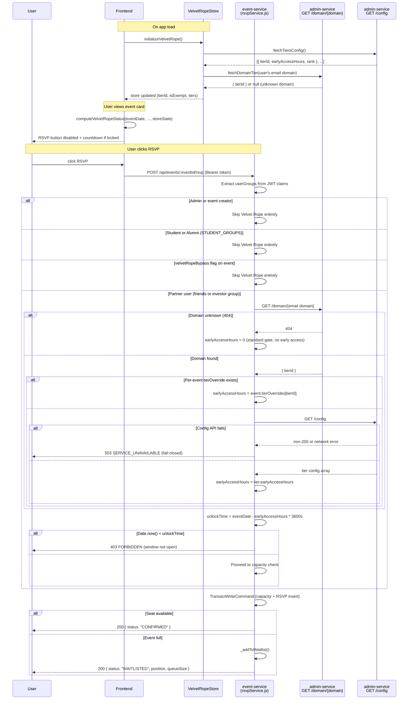

# Event Service — API & Data Reference

> Technical reference for the event-service. For onboarding, setup, and architecture rationale see [README.md](README.md).
>
> Last updated: 2026-04-25. Team 12th Man, Spring 2026.

---

## 1. HTTP API reference

Base URL (local dev): `http://localhost:3005`
Base URL (deployed): injected via `VITE_EVENT_API_URL` in the frontend; set by Terraform API Gateway output.

Auth levels:
- **Public** — no `Authorization` header required.
- **Authenticated** — requires `Authorization: Bearer <Cognito id_token>`.
- **Admin** — authenticated + user must belong to one of the admin Cognito groups.

In local dev without `COGNITO_USER_POOL_ID` set: use `Authorization: Bearer admin-token` for admin routes, any other bearer string for authenticated-user routes.

---

### Health

#### `GET /api/events/health`

| | |
|---|---|
| Auth | Public |
| Response | `200 OK` |

```json
{ "status": "healthy", "service": "event-service", "timestamp": "2026-04-25T12:00:00.000Z" }
```

---

### Event CRUD

#### `GET /api/events`

| | |
|---|---|
| Auth | Public |
| Response | `200 OK` — array of `EventItem` |

Returns all events. No filtering or pagination — `ScanCommand` on the full table. For large datasets this will be slow; add a GSI if needed.

---

#### `GET /api/events/:eventId`

| | |
|---|---|
| Auth | Public |
| Path param | `eventId` — UUID |
| Response | `200 OK` — single `EventItem` |
| Errors | `404` event not found |

---

#### `POST /api/events`

| | |
|---|---|
| Auth | Admin |
| Response | `201 Created` — created `EventItem` |
| Errors | `400` missing required field or invalid capacity, `401`/`403` auth |

Request body:

```json
{
  "title": "CMIS Info Night",
  "date": "2026-05-15T19:00:00.000Z",
  "category": "NETWORKING",
  "capacity": 80,
  "description": "Optional",
  "location": "Wehner 110",
  "velvetRopeBypass": false,
  "tierOverrides": { "gold": 72, "silver": 48 },
  "rsvpDeadline": "2026-05-14T23:59:00.000Z"
}
```

Required fields: `title`, `date`, `category`, `capacity`. Category is normalized to uppercase. `capacity` must be a positive integer. `tierOverrides` maps tierId strings to early-access hours (overrides the global config for that event).

---

#### `PUT /api/events/:eventId`

| | |
|---|---|
| Auth | Admin |
| Path param | `eventId` — UUID |
| Response | `200 OK` — updated `EventItem` |
| Errors | `409` version conflict, `401`/`403` auth |

Request body: any subset of `CreateEventPayload` fields. Include `version` (the value you read from `GET /api/events/:eventId`) to enable optimistic locking — if another user saved between your read and your write, you get a 409.

Fields `eventId`, `currentRsvps`, and `createdAt` are silently stripped from the update — they cannot be overwritten.

---

#### `DELETE /api/events/:eventId`

| | |
|---|---|
| Auth | Admin |
| Response | `200 OK` — `{ "eventId": "...", "deleted": true }` |

Does not delete RSVPs or survey data. Orphaned rows remain in EventRsvps, SurveyTemplates, SurveyResponses.

---

### RSVP

#### `POST /api/events/:eventId/rsvp`

| | |
|---|---|
| Auth | Authenticated |
| Path param | `eventId` |
| Response | `200 OK` |

No request body. Email and group membership are taken from the JWT claims.

**Response (CONFIRMED):**
```json
{ "eventId": "...", "userId": "...", "rsvpAt": "2026-04-25T12:00:00.000Z", "status": "CONFIRMED" }
```

**Response (WAITLISTED):**
```json
{
  "eventId": "...", "userId": "...", "status": "WAITLISTED",
  "waitlistedAt": "2026-04-25T12:00:00.000Z",
  "position": 3, "queueSize": 5,
  "message": "Event is full. You've been added to the waitlist at position 3."
}
```

| Status | Condition |
|---|---|
| `200` CONFIRMED | Seat available; atomic increment + insert succeeded |
| `200` WAITLISTED | Event full; added to priority waitlist |
| `403` | Velvet Rope gate: RSVP window not yet open for your tier; or RSVP deadline passed |
| `409` | Already RSVP'd or on the waitlist |
| `503` | Admin-service tier lookup failed (Velvet Rope fail-closed) |

**Exemptions from Velvet Rope:** Admins, event creators, and users in the `students` or `alumni` Cognito groups bypass the time gate entirely. Users in `friends` (non-student former members) are subject to gating.

---

#### `DELETE /api/events/:eventId/rsvp`

| | |
|---|---|
| Auth | Authenticated |
| Response | `200 OK` |

```json
{ "eventId": "...", "userId": "...", "status": "cancelled" }
```

If a WAITLISTED user was promoted during this cancellation:
```json
{ "eventId": "...", "userId": "...", "status": "cancelled", "promoted": "<promoted-userId>" }
```

Errors: `404` no RSVP found.

---

#### `GET /api/events/:eventId/rsvp`

| | |
|---|---|
| Auth | Admin |
| Response | `200 OK` — array of `RsvpRecord` (CONFIRMED + WAITLISTED) |

---

#### `GET /api/events/:eventId/waitlist/position`

| | |
|---|---|
| Auth | Authenticated |
| Response | `200 OK` |

```json
{ "eventId": "...", "userId": "...", "position": 2, "queueSize": 4 }
```

Errors: `404` user not on the waitlist for this event.

Position is 1-based. Queue is sorted: lower `tierRank` wins (VIP first), then earlier `waitlistedAt` (FIFO within tier).

---

#### `GET /api/events/user/rsvps`

| | |
|---|---|
| Auth | Authenticated |
| Response | `200 OK` — array of `RsvpRecord` for the authenticated user |

Uses the `userId-index` GSI on the RSVP table. Returns all statuses (CONFIRMED and WAITLISTED).

---

### Surveys

#### `GET /api/surveys/:eventId`

| | |
|---|---|
| Auth | Admin |
| Response | `200 OK` — `SurveyTemplate` |

---

#### `PUT /api/surveys/:eventId`

| | |
|---|---|
| Auth | Admin |
| Response | `200 OK` — updated `SurveyTemplate` |
| Errors | `400` if `questions` is missing or empty array |

Request body:
```json
{
  "questions": [
    { "id": "q1", "text": "How would you rate this event?", "type": "rating", "min": 1, "max": 5 }
  ]
}
```

---

#### `GET /api/surveys/:eventId/respond`

| | |
|---|---|
| Auth | Public (accessed via emailed link) |
| Query param | `userId` (required) |
| Response | `200 OK` — `{ event: { eventId, title, date }, template: SurveyTemplate }` |
| Errors | `400` missing userId, `404` event not found |

---

#### `POST /api/surveys/:eventId/respond`

| | |
|---|---|
| Auth | Public |
| Response | `201 Created` |
| Errors | `400` missing userId or responses object, `409` already responded |

Request body:
```json
{
  "userId": "...",
  "userEmail": "student@tamu.edu",
  "responses": { "q1": 4, "q2": 5 }
}
```

---

### Analytics

#### `GET /api/analytics/event-success`

| | |
|---|---|
| Auth | Admin |
| Response | `200 OK` — `EventSuccessAnalytics` |

Returns RSVP count, check-in count, check-in rate, average survey rating, and response count grouped by event category. Also includes aggregate totals. See `EventSuccessAnalytics` interface in `frontend/src/lib/events-api.ts`.

---

#### `POST /api/events/:eventId/send-survey`

| | |
|---|---|
| Auth | Admin |
| Response | `200 OK` — `{ eventId, sent: number, total: number }` |
| Errors | `404` event not found |

Sends a survey email via SES to every attendee who has `checkedIn: true` and a non-empty `userEmail`. Uses `process.env.SES_VERIFIED_SENDER` — if the env var is unset, emails are logged to CloudWatch but not sent (no error returned). The survey link format is `{FRONTEND_URL}/?surveyEventId=...&surveyUserId=...&surveyUserEmail=...`.

---

### Calendar

See [Section 6 — Calendar/ICS reference](#6-calendarics-reference) for format details and sample output.

#### `GET /api/events/:eventId/calendar`

| | |
|---|---|
| Auth | Public |
| Response | `200 OK` — `text/calendar` attachment |
| Headers | `Content-Disposition: attachment; filename="event-{eventId}.ics"` |
| Errors | `404` event not found |

---

#### `GET /api/users/me/calendar`

| | |
|---|---|
| Auth | Authenticated |
| Response | `200 OK` — `text/calendar` attachment |
| Headers | `Content-Disposition: attachment; filename="my-schedule.ics"` |

Returns all CONFIRMED RSVPs for the authenticated user as a multi-event ICS file. WAITLISTED entries are excluded. If the user has no confirmed RSVPs, returns a valid empty VCALENDAR (not a 404).

---

## 2. DynamoDB schema reference

All tables use on-demand billing (`PAY_PER_REQUEST`) and server-side encryption. Events and EventRsvps have `prevent_destroy = true` in Terraform.

---

### `Events-{stage}`

| Attribute | Type | Required | Notes |
|---|---|---|---|
| `eventId` | S | Yes | UUID v4. Partition key. |
| `title` | S | Yes | |
| `date` | S | Yes | ISO 8601 UTC string. |
| `category` | S | Yes | Always uppercase (normalized on write). |
| `capacity` | N | Yes | Positive integer. |
| `currentRsvps` | N | Yes | Managed by service — do not write directly. |
| `version` | N | Yes | Starts at 1. Incremented on every update for optimistic locking. |
| `description` | S | No | Defaults to `""`. |
| `location` | S | No | Defaults to `""`. |
| `createdBy` | S | No | userId of creating admin. |
| `velvetRopeBypass` | BOOL | No | If `true`, Velvet Rope gate is skipped for all users. |
| `tierOverrides` | M | No | Map of `{ tierId: earlyAccessHours }`. Overrides global config. |
| `rsvpDeadline` | S | No | ISO 8601 UTC. RSVP rejected after this time. |
| `createdAt` | S | Yes | ISO 8601, set on create. |
| `updatedAt` | S | Yes | ISO 8601, updated on every write. |
| `endDate` | S | No | Optional end time for ICS generation. If absent, ICS assumes +1 hour. |

**Sample items:**

```json
{
  "eventId": "a1b2c3d4-...",
  "title": "CMIS Networking Night",
  "date": "2026-05-15T19:00:00.000Z",
  "category": "NETWORKING",
  "capacity": 80,
  "currentRsvps": 72,
  "version": 5,
  "description": "Come meet recruiters from partner companies.",
  "location": "Wehner 110",
  "createdBy": "admin-user-id",
  "velvetRopeBypass": false,
  "tierOverrides": { "gold": 72, "silver": 48 },
  "rsvpDeadline": "2026-05-14T23:59:00.000Z",
  "createdAt": "2026-04-01T10:00:00.000Z",
  "updatedAt": "2026-04-20T14:30:00.000Z"
}
```

```json
{
  "eventId": "b2c3d4e5-...",
  "title": "Resume Workshop",
  "date": "2026-04-30T17:00:00.000Z",
  "category": "WORKSHOP",
  "capacity": 30,
  "currentRsvps": 30,
  "version": 2,
  "description": "",
  "location": "",
  "createdBy": "admin-user-id",
  "velvetRopeBypass": true,
  "tierOverrides": {},
  "rsvpDeadline": null,
  "createdAt": "2026-04-10T08:00:00.000Z",
  "updatedAt": "2026-04-10T08:00:00.000Z"
}
```

---

### `EventRsvps-{stage}`

| Attribute | Type | Required | Notes |
|---|---|---|---|
| `eventId` | S | Yes | Partition key. |
| `userId` | S | Yes | Sort key. Cognito `sub`. |
| `userEmail` | S | Yes | Defaults to `""` if Cognito didn't provide one. |
| `status` | S | Yes | `"CONFIRMED"` or `"WAITLISTED"`. |
| `rsvpAt` | S | CONFIRMED only | ISO 8601 timestamp. |
| `waitlistedAt` | S | WAITLISTED only | ISO 8601 timestamp. Removed on promotion. |
| `confirmedAt` | S | No | Set when promoted from WAITLISTED. |
| `tierRank` | N | WAITLISTED only | Lower = higher priority. 99 = student/unknown. |
| `checkedIn` | BOOL | No | Set by QR check-in feature (another team). |
| `checkedInAt` | S | No | ISO 8601. Set by check-in feature. |

**GSI — `userId-index`:** PK: `userId`. Projection: ALL. Used by `getUserRsvps()` and `getUserSchedule()`.

**Streams:** `NEW_AND_OLD_IMAGES`. INSERT events fire RSVP confirmation emails; MODIFY events where `status` transitions from `WAITLISTED` to `CONFIRMED` fire promotion emails.

**Sample items:**

```json
{
  "eventId": "a1b2c3d4-...",
  "userId": "cognito-sub-abc123",
  "userEmail": "student@tamu.edu",
  "status": "CONFIRMED",
  "rsvpAt": "2026-04-25T10:00:00.000Z"
}
```

```json
{
  "eventId": "a1b2c3d4-...",
  "userId": "cognito-sub-def456",
  "userEmail": "partner@goldcorp.com",
  "status": "WAITLISTED",
  "waitlistedAt": "2026-04-25T10:05:00.000Z",
  "tierRank": 1
}
```

```json
{
  "eventId": "a1b2c3d4-...",
  "userId": "cognito-sub-ghi789",
  "userEmail": "partner@goldcorp.com",
  "status": "CONFIRMED",
  "rsvpAt": "2026-04-25T10:05:00.000Z",
  "confirmedAt": "2026-04-26T09:00:00.000Z",
  "tierRank": 1
}
```

---

### `SurveyTemplates-{stage}`

| Attribute | Type | Required | Notes |
|---|---|---|---|
| `eventId` | S | Yes | Partition key. One template per event. |
| `questions` | L | Yes | List of question objects. |
| `isDefault` | BOOL | No | Whether this is a copied default template. |
| `createdAt` | S | Yes | ISO 8601. |
| `updatedAt` | S | Yes | ISO 8601. |
| `createdBy` | S | Yes | Admin userId who created/last updated. |

Each question in `questions`:
```json
{ "id": "q1", "text": "How would you rate this event?", "type": "rating", "min": 1, "max": 5 }
```

---

### `SurveyResponses-{stage}`

| Attribute | Type | Required | Notes |
|---|---|---|---|
| `eventId` | S | Yes | Partition key. |
| `userId` | S | Yes | Sort key. |
| `userEmail` | S | No | From request body (not JWT — survey link is public). |
| `responses` | M | Yes | Map of `{ questionId: numericRating }`. |
| `submittedAt` | S | Yes | ISO 8601. |

One response per (eventId, userId) — duplicate submissions return 409.

---

## 3. Service layer reference

### `eventService.js`

Singleton exported as `module.exports = new EventService()`.

| Method | Signature | Returns | Throws |
|---|---|---|---|
| `listEvents()` | `()` | `Promise<EventItem[]>` | DynamoDB errors |
| `getEvent(eventId)` | `(string)` | `Promise<EventItem \| null>` | DynamoDB errors |
| `createEvent(eventData, createdBy)` | `(object, string)` | `Promise<EventItem>` | `400` missing fields or invalid capacity |
| `updateEvent(eventId, updateData)` | `(string, object)` | `Promise<EventItem>` | `409` version conflict |
| `deleteEvent(eventId)` | `(string)` | `Promise<{eventId, deleted}>` | DynamoDB errors |

**`createEvent`** (lines 52–78): Assigns UUID, sets `currentRsvps: 0`, `version: 1`, `createdAt`/`updatedAt` to `now`. Normalizes category to uppercase. Protected fields (`eventId`, `currentRsvps`, `createdAt`) cannot be in `eventData` — they are always set by the service.

**`updateEvent`** (lines 81–141): Builds a `SET` expression dynamically from the keys in `updateData`. Always increments `version`. If `updateData.version` is provided, adds a `ConditionExpression` that checks the current stored version equals `updateData.version`. On `ConditionalCheckFailedException`, throws a 409 error with a user-readable message. Race condition handled: two concurrent updates with the same version number — the second one gets a 409.

---

### `rsvpService.js`

Singleton exported as `module.exports = new RsvpService()`.

| Method | Signature | Returns | Throws |
|---|---|---|---|
| `rsvpToEvent(eventId, userId, userEmail, userGroups)` | `(string, string, string, string[])` | `Promise<ConfirmedResult \| WaitlistedResult>` | `404` event not found, `403` deadline or Velvet Rope, `409` duplicate, `503` tier lookup failed |
| `cancelRsvp(eventId, userId)` | `(string, string)` | `Promise<CancelResult>` | `404` no RSVP found |
| `getWaitlistPosition(eventId, userId)` | `(string, string)` | `Promise<{eventId, userId, position, queueSize}>` | `404` not on waitlist |
| `getEventRsvps(eventId)` | `(string)` | `Promise<RsvpRecord[]>` | DynamoDB errors |
| `getUserRsvps(userId)` | `(string)` | `Promise<RsvpRecord[]>` | DynamoDB errors |
| `hasUserRsvpd(eventId, userId)` | `(string, string)` | `Promise<boolean>` | DynamoDB errors |

**`rsvpToEvent`** (lines 35–148): Fetch event → check RSVP deadline → check Velvet Rope → build `TransactWriteCommand` → on `TransactionCanceledException` inspect `CancellationReasons[0]` (capacity) and `[1]` (duplicate) independently. Capacity failure → `_addToWaitlist()`. Duplicate failure → 409.

**`_fetchPartnerEarlyAccessHours(userEmail, eventTierOverrides)`** (lines 161–213): Returns `number` (0 = no gate) or `null` (fail-closed). Handles: missing env vars → `null`, unknown domain (404 from admin-service) → `0`, per-event override present → short-circuits step 2, `earlyAccessHours` is not a number → `0`, any network/parse error → `null`.

Note: `_fetchPartnerTierRank()` (lines 218–254) uses `config?.tiers || []` as its fallback parse path, while `_fetchPartnerEarlyAccessHours()` uses `Array.isArray(config) ? config : (config?.tiers || [])`. If admin-service returns a plain array, `_fetchPartnerTierRank` may return rank 99 unexpectedly. These two methods should be kept in sync if the admin-service response format changes.

**`cancelRsvp`** (lines 343–436): Three branches — (1) WAITLISTED: simple delete, no seat to free; (2) CONFIRMED + waitlist non-empty: `TransactWriteCommand` deletes the RSVP and promotes the next-in-line (condition `#s = WAITLISTED` on the update prevents double-promotion if two cancels race), `currentRsvps` unchanged; (3) CONFIRMED + empty waitlist: `TransactWriteCommand` deletes RSVP and decrements `currentRsvps` (conditioned on `currentRsvps > 0`).

---

### `calendarService.js`

Singleton. Two public methods.

| Method | What it does |
|---|---|
| `getEventCalendar(eventId)` | Fetches event from Events table, throws 404 if missing, calls `buildICS([event])`. |
| `getUserSchedule(userId)` | Queries RSVP table via `userId-index` filtering for `status = 'CONFIRMED'`, batch-fetches event records, calls `buildICS(events)`. Returns valid empty VCALENDAR if user has no confirmed RSVPs. |

### `surveyService.js`

Not covered in the original inventory. See `src/services/surveyService.js` for the full implementation. Key behaviors: `upsertTemplate()` sets `updatedAt` on every call; `submitResponse()` uses `attribute_not_exists` condition to prevent duplicate submissions (409 on conflict).

### `analyticsService.js`

Not covered in the original inventory. Aggregates data from the Events, EventRsvps, and SurveyResponses tables. Returns counts and rates grouped by `category`. See `src/services/analyticsService.js`.

---

## 4. Frontend module reference

All files are in `frontend/src/lib/` on the `develop` branch unless noted.

---

### `events-api.ts`

The HTTP client for the event-service. Fully owned by Team 12th Man.

**Auth:** `authHeaders()` calls `getCognitoIdToken()` and injects `Authorization: Bearer <token>` on every request that needs it.

**Key interfaces:**

| Interface | Fields |
|---|---|
| `EventItem` | `eventId`, `title`, `date`, `category`, `capacity`, `currentRsvps`, `version`, `createdAt`, `updatedAt`, + optional: `description`, `location`, `createdBy`, `velvetRopeBypass`, `tierOverrides`, `rsvpDeadline` |
| `CreateEventPayload` | Required: `title`, `date`, `category`, `capacity`. Optional: `description`, `location`, `velvetRopeBypass`, `tierOverrides`, `rsvpDeadline` |
| `RsvpRecord` | `eventId`, `userId`, `rsvpAt`, + optional: `userEmail`, `status`, `checkedIn`, `checkedInAt` |
| `EventHealth` | `status`, `service`, `timestamp` |

**Exported functions:**

| Function | Auth | Returns |
|---|---|---|
| `listEvents()` | None | `EventItem[]` |
| `getEvent(eventId)` | None | `EventItem` |
| `createEvent(payload)` | Auth | `EventItem` |
| `updateEvent(eventId, payload)` | Auth | `EventItem` |
| `deleteEvent(eventId)` | Auth | `void` |
| `rsvpToEvent(eventId)` | Auth | `{ status, message? }` |
| `cancelRsvp(eventId)` | Auth | `{ status }` |
| `getEventRsvps(eventId)` | Auth | `RsvpRecord[]` |
| `getUserRsvps()` | Auth | `RsvpRecord[]` |
| `getEventCalendarUrl(eventId)` | None | `string` (URL only, no fetch) |
| `getUserScheduleIcs()` | Auth | `string` (raw ICS text) |
| `getEventHealth()` | None | `EventHealth` |
| `getSurveyTemplate(eventId)` | Auth | `SurveyTemplate` |
| `saveSurveyTemplate(eventId, questions)` | Auth | `SurveyTemplate` |
| `getSurveyForm(eventId, userId)` | None | `SurveyFormData` |
| `submitSurveyResponse(eventId, userId, email, responses)` | None | `void` |
| `getEventSuccessAnalytics()` | Auth | `EventSuccessAnalytics` |
| `sendSurveyEmails(eventId)` | Auth | `{ sent, total }` |
| `getEventQr(eventId)` | Auth | `EventQrPayload` (QR check-in — not owned by Team 12th Man) |
| `selfCheckIn(scannedText, expectedEventId)` | Auth | `EventSelfCheckinPayload` (QR check-in — not owned by Team 12th Man) |

`getEventCalendarUrl()` returns a URL string directly (no fetch) for use in `<a href="...">` links. `getUserScheduleIcs()` must be called from JS (it requires auth headers) — trigger a download by creating a Blob URL.

---

### `EventsDashboard.svelte`

Shared file. Team 12th Man owns: RSVP state (`userRsvpIds`, `userRsvpsMap`), `handleRsvp()`/`handleCancelRsvp()` with waitlist detection, WAITLISTED badge, "Leave Waitlist" vs "Cancel RSVP" button toggle, event filtering (`filteredEvents`, `filterCategory`, `filterDate`, `showPastEvents`), attendee modal, soft-cancel modal, admin action buttons, Velvet Rope countdown banner, "Add to Calendar" and "Export My Schedule" buttons.

**Not owned:** QR check-in scanner state and scanner UI (added by aupragathii in PR #158).

The waitlist state machine is the most complex part: `userRsvpsMap` is a `Map<eventId, RsvpRecord>` allowing O(1) status lookup. `handleRsvp()` checks the response `status` field — if `"WAITLISTED"`, updates the badge without updating the confirmed RSVP count.

---

### `velvetRope.ts`

```ts
computeVelvetRopeStatus(
  eventDate: string,
  eventCreatedBy: string,
  currentUserId: string,
  state: VelvetRopeState,
  eventBypass?: boolean,
  eventTierOverrides?: Record<string, number>,
  eventDeadline?: string
): VelvetRopeStatus
```

Pure function — no side effects, no API calls. Returns a `VelvetRopeStatus` object: `{ locked: boolean, message: string, unlockTime?: Date }`. The `message` contains the user-facing countdown string (e.g., `"🔒 Opens for Gold in 2 hours"`).

Creator exemption and student bypass are checked first. Domain-to-tier resolution uses the pre-fetched `state` from `velvetRopeStore` — the function does not make API calls.

---

### `velvetRopeStore.ts`

```ts
velvetRopeStore: Writable<VelvetRopeState>
initializeVelvetRope(): Promise<void>
```

`initializeVelvetRope()` fetches tier config (via `tiers-api.ts → fetchTiersConfig()`) and resolves the current user's email domain to a `tierId` (via `fetchDomainTier()`). Sets `isExempt: true` for students and admins. Called once at app startup. The store state is consumed by `computeVelvetRopeStatus()`.

---

### `tiers-api.ts`

```ts
fetchTiersConfig(): Promise<TierConfig[]>   // GET VITE_CONFIG_API_URL
fetchDomainTier(domain: string): Promise<DomainConfig | null>  // GET VITE_COMPANIES_API_URL/{domain}
```

Thin HTTP wrappers against admin-service. Returns `null` for unknown domains. Used only by `velvetRopeStore`.

---

### `types.ts` (partial ownership)

Team 12th Man owns:
- `Tier` interface: `{ tierId: string, name: string, rank: number, earlyAccessHours: number }`
- `Company` interface: `{ companyId: string, name: string, domain: string, tierId: string }`
- `"events"` value in the `ViewName` union type

---

## 5. Velvet Rope flow

The Velvet Rope spans backend enforcement (`rsvpService.js`) and frontend display (`velvetRope.ts`, `velvetRopeStore.ts`) and depends on admin-service for tier configuration.



### Fail-closed behavior

If either admin-service call returns a non-200 response **or** throws a network error, `_fetchPartnerEarlyAccessHours()` returns `null`. The caller in `rsvpToEvent()` treats `null` as a hard failure and returns **503 SERVICE_UNAVAILABLE** — it does not guess at the user's tier or grant access by default. This means if admin-service is down, partner-tier RSVPs are blocked. Students and admins are unaffected (they bypass the lookup entirely).

### Frontend vs backend discrepancy risk

The frontend countdown (`computeVelvetRopeStatus`) uses the tier data fetched at app-load time from the store. If an admin changes tier config between page load and RSVP submission, the frontend may show the button as enabled while the backend still rejects it with 403. This is a known trade-off — the frontend UI is advisory and the backend is always authoritative.

---

## 6. Calendar/ICS reference

### Endpoints

| Endpoint | Auth | Filename |
|---|---|---|
| `GET /api/events/:eventId/calendar` | Public | `event-{eventId}.ics` |
| `GET /api/users/me/calendar` | Authenticated | `my-schedule.ics` |

Frontend usage:
```ts
// Single event — use as plain href (public, no auth needed)
const url = getEventCalendarUrl(eventId);
// <a href={url} download>Add to Calendar</a>

// User schedule — must fetch with auth, then trigger download from JS
const ics = await getUserScheduleIcs();
const blob = new Blob([ics], { type: 'text/calendar' });
const blobUrl = URL.createObjectURL(blob);
// trigger download via <a> element
```

### ICS format

Generated by `src/lib/icsBuilder.js`. RFC 5545 compliant. Line endings are CRLF (`\r\n`). Long lines are not folded (folding at 75 octets is SHOULD in RFC 5545, not MUST — most clients handle unfolded lines correctly).

**PRODID:** `-//CMIS Platform//Event Service//EN`

**Event fields mapped:**

| Event attribute | ICS property | Notes |
|---|---|---|
| `eventId` | `UID` | Format: `{eventId}@cmis-platform` |
| `date` | `DTSTART` | UTC format: `YYYYMMDDTHHmmssZ` |
| `endDate` (optional) | `DTEND` | If absent: `DTSTART + 1 hour` |
| `title` | `SUMMARY` | Commas, semicolons, backslashes, newlines escaped |
| `description` | `DESCRIPTION` | Same escaping; omitted if empty |
| `location` | `LOCATION` | Same escaping; omitted if empty |

Events with unparseable `date` values are silently skipped with a `console.warn`. An empty event array produces a valid VCALENDAR with no VEVENTs.

### Sample output

```
BEGIN:VCALENDAR\r\n
VERSION:2.0\r\n
PRODID:-//CMIS Platform//Event Service//EN\r\n
CALSCALE:GREGORIAN\r\n
METHOD:PUBLISH\r\n
BEGIN:VEVENT\r\n
UID:a1b2c3d4-e5f6-...@cmis-platform\r\n
DTSTAMP:20260425T120000Z\r\n
DTSTART:20260515T190000Z\r\n
DTEND:20260515T200000Z\r\n
SUMMARY:CMIS Networking Night\r\n
DESCRIPTION:Come meet recruiters from partner companies.\r\n
LOCATION:Wehner 110\r\n
END:VEVENT\r\n
END:VCALENDAR\r\n
```

### Client compatibility

| Client | Notes |
|---|---|
| **Google Calendar** | Works. Accepts the direct `.ics` URL for single-event import. |
| **Apple Calendar (macOS/iOS)** | Works. Single-event URL opens the "Add Event" sheet directly. |
| **Outlook (desktop)** | Works. Import via File → Open & Export → Import/Export. |
| **Outlook (web)** | Works for single-event import. User-schedule multi-event import depends on Outlook version. |

The `METHOD:PUBLISH` property signals that these are informational calendar entries, not meeting invitations — clients will not send accept/decline replies.

You can run `node src/lib/icsBuilder.js` directly to see sample output and run the built-in assertions (it doubles as a self-test when executed as a script).
