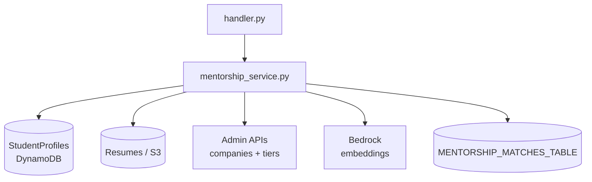
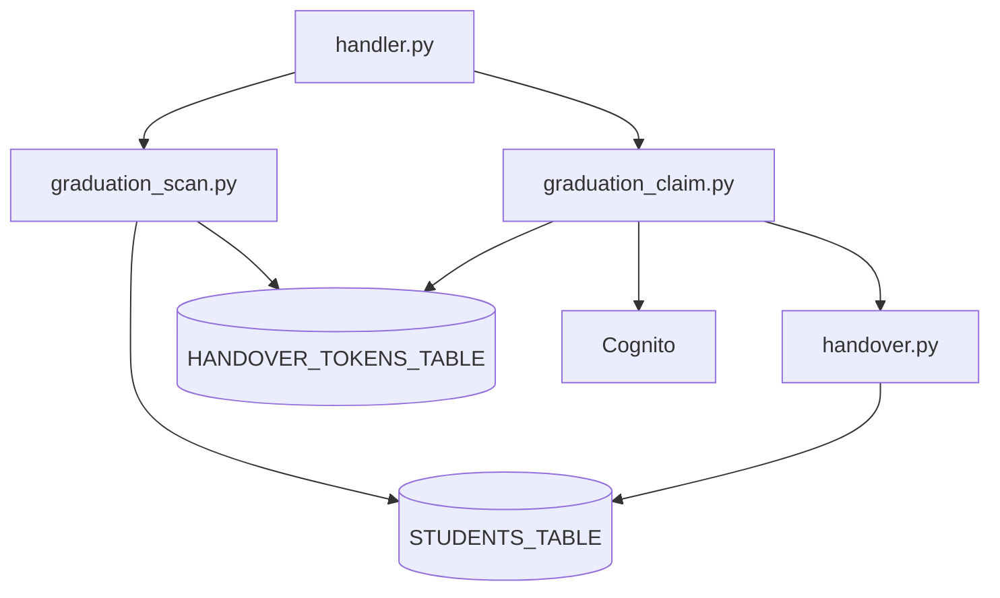

# External Service Implementation Notes

This document is the maintainer guide for everything under `services/external-service`.
It complements `README.md` (API surface) and `MENTORSHIP.md` (matching details) with
practical implementation notes for each module.

---

## 0) For the next CMIS cohort (start here)

**Goal of this folder:** one deployable **Python Lambda** that implements **external-user** journeys (auth, graduation handover, mentorship) and integrates with **Cognito**, **DynamoDB**, **Bedrock**, optional **SES**, and other CMIS services over HTTP.

**Read order for a clean macro picture:**

1. **[HANDOFF_FOR_NEXT_TEAM.md](HANDOFF_FOR_NEXT_TEAM.md)** — system context, diagram, first-week plan, operational cautions.
2. **This file** — how code is split across modules and how HTTP vs async events flow.
3. **[README.md](README.md)** — every route and environment variable (contract with deploy/ops).
4. **[MENTORSHIP.md](MENTORSHIP.md)** — scoring, caps, and match lifecycle details.

**Big-picture data flow (mentorship):**

**Big-picture data flow (graduation handover):**

**Glossary (terms you will see in code and tickets):**

| Term | Meaning |
|------|---------|
| **External user** | Account in the external pool; may be partner, friend, or former student after handover. |
| **Handover** | Linking a graduate’s **UIN** to their external account and moving them toward alumni-style access. |
| **Magic link** | Time-limited token URL; raw token is not stored—only a **hash** is stored in DynamoDB. |
| **Board tier / boost** | Extra score multiplier for mentors tied to sponsor company tier (from admin company + tier APIs). |
| **Synthetic counter row** | Special match row `__MENTEE_CHANNEL_STATE__` used to enforce mentee concurrent match caps safely. |

---

## 1) Service boundaries and ownership

- **Service owner:** Team Gig 'Em (`external-service`).
- **Runtime:** AWS Lambda (Python 3.12) fronted by API Gateway.
- **Primary integrations:**
  - **Cognito** for auth and group membership updates.
  - **DynamoDB** for users, handover tokens/logs, mentorship matches/embeddings/snapshots.
  - **Bedrock** for embeddings and optional LLM-generated mentor insights.
  - **Admin APIs** (`/companies`, `/tiers`) for board-tier boost multipliers.
  - **Student data** for profile and resume enrichment.

## 2) Request flow at a glance

1. API Gateway forwards request to `handler.lambda_handler`.
2. `handler._route()` normalizes HTTP API/REST payload shapes.
3. Endpoint handler resolves current user from bearer token (Access token first, ID token fallback).
4. Business module performs operation:
   - auth / account logic (`auth.py`, `db.py`, `role_engine.py`)
   - graduation flow (`graduation_scan.py`, `graduation_claim.py`, `handover.py`)
   - mentorship logic (`mentorship_*` modules)
5. Handler returns a JSON payload via `_response()` with CORS headers.

## 3) Async and scheduled invocation paths

- **Scheduled graduation scan:** EventBridge (`aws.events` / `Scheduled Event`) -> `do_graduation_scan()`.
- **Mentorship scheduled run:** payload sources `scheduled-batch` / `cmis.mentorship.batch`.
- **Late registration matching:** payload sources `late-registration` / `cmis.mentorship.late-registration`.
- **Profile-saved embedding precompute:** source `cmis.mentorship.profile-saved`.
- **Admin run queue:** source `cmis.mentorship.admin-run` (self-invoked async Lambda event).

## 4) Data model notes

The definitive table mapping lives in `docs/DATABASE_TABLES_MAPPING.md`, but these are the core
external-service behaviors to remember:

- **External users table**
  - source of truth for external role metadata (`role`, `class_year`, `linked_uin`).
  - keys expected by `db.py`: `user_id` plus GSIs for `email` and `linked_uin`.
- **Handover token table**
  - `token_hash` primary key; token is stored hashed (SHA-256), not plaintext.
  - `claimed` + `expires_at` enforce one-time and time-bound claims.
- **Mentorship matches table**
  - PK `mentorUserId`, SK `menteeUserId`.
  - includes synthetic row with mentor id `__MENTEE_CHANNEL_STATE__` for per-mentee active channel counters.
- **Mentorship embeddings table**
  - PK `userId`, SK `profileKind` (`mentor` | `mentee`).
  - stores canonical text preview + vector + metadata for cache reuse.

## 5) Module-by-module notes

### `handler.py`

- Main router and integration coordinator.
- Contains:
  - auth endpoints (`/auth/*`)
  - profile endpoint (`/me`)
  - graduation endpoints
  - mentorship mentor/mentee/admin endpoints
  - async/scheduled event dispatch.
- Important behavior:
  - Supports access token and ID token fallback parsing for broader client compatibility.
  - Uses explicit role/profile guards (`_is_mentor_profile`, `_is_mentee_profile`).
  - Removes score internals before returning mentor-facing candidate rows.

### `auth.py`

- Thin Cognito helper layer (signup/signin/reset/get user).
- Keeps Cognito calls isolated from endpoint routing logic.
- `admin_set_custom_attributes()` intentionally tolerates pools without matching custom attrs.

### `db.py`

- External-user DynamoDB CRUD/query helper.
- Consolidates user shape updates and keeps key names centralized.
- Used by signup/signin/me/handover flows.

### `role_engine.py`

- Determines initial registration role:
  - partner domain -> `PARTNER`
  - former student checkbox (+ class year) -> `FORMER_STUDENT`
  - otherwise -> `FRIEND`
- Pulls partner domains from Team Howdy-compatible company API when configured.

### `validation.py`

- Shared input normalization helpers used by flows that need lightweight checks.
- Keeps common email/UIN/password rules in one place.

### `handover.py`

- Handles direct UIN linking operations for authenticated users.
- Enforces uniqueness constraints and updates both DynamoDB + Cognito attributes.

### `graduation_scan.py`

- Scheduled/self-service magic-link issuer for graduating students.
- Writes hashed token rows and optionally delivers via SES.
- Falls back to logging links when SES sender is not configured.

### `graduation_claim.py`

- Validates token and completes claim process.
- Reuses existing account when possible (personal or TAMU email record), otherwise creates one.
- Marks token claimed and sends confirmation mail when SES is configured.

### `handover_log.py`

- Optional handover audit stream with 90-day TTL.
- Intentionally best-effort (logging errors do not break user flow).

### `audit_log.py`

- Generic audit logging stub (currently no-op).
- Exists as extension point for future non-handover audit events.

### `mentorship_embeddings.py`

- Embedding provider abstraction and diagnostics.
- Supports Bedrock Titan and Bedrock Cohere providers.
- Includes cosine similarity + batched embedding helpers.

### `mentorship_matching.py`

- Canonical text builders and rule-score logic.
- Produces explainability signals used in API responses and narrator prompts.

### `mentorship_board.py`

- Company/tier resolution and board multiplier assignment.
- Merges classic `gold/silver/bronze` and rank-based tier configurations.
- Caches `/companies` and `/tiers` responses for low-latency repeated scoring.

### `mentorship_narrator.py`

- Bedrock Nova helper for:
  - match reason text
  - first-contact icebreaker
  - skill gap suggestions.
- Falls back to deterministic text on model failures.

### `mentorship_service.py`

- Largest mentorship orchestration layer:
  - ranking and candidate build
  - match status transitions (suggest/accept/skip/decline/revive)
  - channel-cap enforcement
  - annual/late-registration matching
  - admin run scheduling + run audit persistence.
- Treat this as the source of truth for mentorship state machine behavior.

### `seed_students.py`

- Convenience script for loading local/dev student seed data into `STUDENTS_TABLE`.
- Not used in Lambda runtime path.

### `seed_test_user.py`

- Convenience script to create a test external user record in DynamoDB.
- Supports Cognito lookup by email or explicit `--user-id`.

### `index.js` and `package.json`

- Legacy Node wrapper with basic health endpoints.
- Current production routing is Python-first (`handler.py`), but this remains as auxiliary tooling.

### `tests/test_mentorship_board_unit.py`

- Unit checks for board-tier resolution and multiplier behavior.
- Key safety net for rank/slug/domain matching regressions.

## 6) Operational guardrails

- Do not expose raw embedding vectors in broad API responses unless explicitly needed.
- Keep mentorship table writes idempotent where possible; retry-safe operations matter in Lambda.
- Treat admin run reset operations as destructive and keep them admin-gated.
- Preserve `MENTEE_MAX_MATCHES` semantics to avoid over-allocation race conditions.

## 7) Documentation maintenance checklist

When changing behavior in this directory, update the following together:

1. `README.md` endpoint table or environment variable section.
2. `MENTORSHIP.md` if scoring/state-machine logic changed.
3. `MENTORSHIP_ADMIN_MATCHING_API.md` if admin contract changed.
4. This file (`EXTERNAL_SERVICE_NOTES.md`) if module ownership or flow changed.
5. **`HANDOFF_FOR_NEXT_TEAM.md`** if cross-service ownership, entry points, or cohort onboarding steps change.

---

## 8) Common “where do I change X?” map

| If you need to… | Start in… |
|-----------------|-----------|
| Add or change an HTTP route | `handler.py` (`_lambda_handler_impl` routing) |
| Change Cognito signup/signin behavior | `auth.py` + callers in `handler.py` (`do_signup`, `do_signin`, …) |
| Change external user DynamoDB shape | `db.py` + any callers expecting attributes |
| Change PARTNER / FORMER_STUDENT rules at registration | `role_engine.py` |
| Change magic-link email copy or delivery | `graduation_scan.py`, `graduation_claim.py` (SES gated by `SES_VERIFIED_SENDER`) |
| Change UIN link validation rules | `handover.py` + `graduation_claim.py` |
| Change embedding model/provider | `mentorship_embeddings.py` + env vars in `README.md` |
| Change “what text goes into vectors” | `mentorship_matching.py` |
| Change sponsor tier boost math | `mentorship_board.py` |
| Change match states, caps, batch matching | `mentorship_service.py` (large) |
| Change LLM-written explanations | `mentorship_narrator.py` |
| Add unit tests for tier resolution | `tests/test_mentorship_board_unit.py` |

---

## 9) Design principles worth preserving

- **Thin handler, thick domain:** keep `handler.py` mostly routing, auth checks, and HTTP shaping; put business rules in dedicated modules.
- **Idempotent accepts:** mentorship accept paths must tolerate duplicate clicks and concurrent writers (see `accept_match` and related helpers on `develop`).
- **Defense in depth for PII:** mentor-facing APIs intentionally strip or redact fields (`redact_mentor_candidate_rows_for_api`, score stripping in `handler.py`).
- **Graceful degradation:** when SES or Bedrock is unavailable, flows should still return sensible JSON (email “not sent”, narrator fallback text, etc.—verify when you change those paths).
