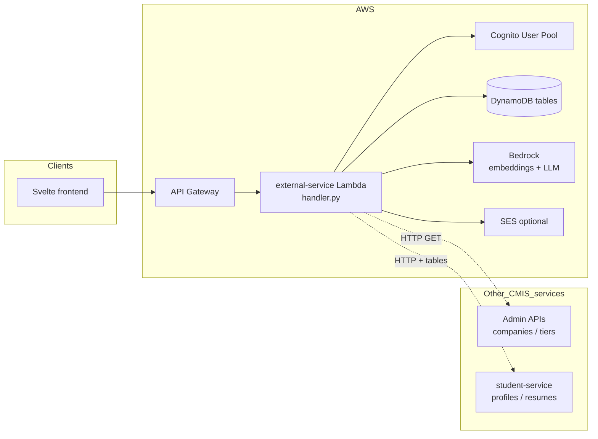

# External Service — Handoff for the Next CMIS Cohort

This short guide is written for **whoever inherits `services/external-service` next**. Read it once for orientation, then use `README.md` (APIs + env vars), `EXTERNAL_SERVICE_NOTES.md` (deeper file map), and `MENTORSHIP.md` (matching behavior) as references while you work.

---

## 1. What this service is (one paragraph)

**External Service** is the **Team Gig ’Em** Lambda: it backs **external users** (partners, alumni, friends) with **Cognito auth**, **DynamoDB profile linkage**, **graduation handover** (magic links + UIN claim), and **mentorship** (semantic ranking, board-tier boosts, match rows, optional Bedrock narration, SES notifications). It does **not** own the main student app’s CRUD for full-time students; it **reads** student profiles/resumes and **calls** admin company/tier APIs where configured.

---

## 2. Macro architecture (how it sits in CMIS)

**Mental model:** API Gateway delivers HTTP events to **`handler.lambda_handler`**. The handler routes to small modules (`auth`, `db`, `graduation_*`, `mentorship_*`). Heavy mentorship logic lives in **`mentorship_service.py`**.

---

## 3. Three product areas (map files to outcomes)

| Area | User-visible goal | Primary modules | Persistent data |
|------|-------------------|-----------------|-------------------|
| **Auth & roles** | Sign up / sign in / reset; assign PARTNER vs FRIEND vs FORMER_STUDENT | `auth.py`, `db.py`, `role_engine.py`, `validation.py` | `EXTERNAL_USERS_TABLE`, Cognito |
| **Graduation handover** | Graduate claims account; link UIN; alumni path | `graduation_scan.py`, `graduation_claim.py`, `handover.py`, `handover_log.py` | `STUDENTS_TABLE`, `HANDOVER_TOKENS_TABLE`, optional `HANDOVER_LOG_TABLE` |
| **Mentorship** | Rank mentors/mentees; queue suggestions; accept → open channel | `mentorship_service.py`, `mentorship_matching.py`, `mentorship_embeddings.py`, `mentorship_board.py`, `mentorship_narrator.py` | `MENTORSHIP_*` tables, Bedrock, optional SES |

---

## 4. How requests vs scheduled jobs enter the same Lambda

| Entry type | How it arrives | Where it is handled |
|------------|----------------|---------------------|
| **HTTP** | API Gateway → `lambda_handler` → `_route()` | `handler.py` (many `do_*` functions) |
| **EventBridge** | `aws.events` / scheduled | `handler.py` → graduation scan |
| **Custom async** | JSON body with `source: cmis.mentorship.*` | `handler.py` → mentorship batch / late reg / admin run / profile embeddings |

If you add a new background trigger, **document the payload shape** next to the existing `source` values in `README.md` and in `EXTERNAL_SERVICE_NOTES.md` section 3.

---

## 5. Cross-team dependencies (who owns what)

| Dependency | Owner / typical repo area | Why external-service cares |
|-------------|---------------------------|-----------------------------|
| Student profiles & skills | **student-service** + `STUDENT_PROFILES_TABLE` | Mentorship ranking reads profile fields and resume extracts |
| Resumes & S3 | **student-service** + `RESUMES_TABLE` / `RESUMES_BUCKET` | Richer canonical text for embeddings; presigned URLs for mentors |
| Company list & tier ranks | **Admin / Team Howdy** APIs (`COMPANY_LIST_API_URL`, `/tiers`) | Partner domains at signup; **board multiplier** at match time |
| Cognito pool & app client | Infra / platform | All auth flows |
| Bedrock models | Infra IAM + env | Embeddings + optional narrator |

When the next cohort changes **profile field names** or **admin API response shapes**, update **`mentorship_matching.py`**, **`mentorship_board.py`**, and any **handler** hydration paths that assume old field names.

---

## 6. Suggested first week for the next team

1. Read this file and **`EXTERNAL_SERVICE_NOTES.md`** sections 1–4 (macro + request flow).
2. Skim **`handler.py`** route table at the bottom (`lambda_handler` / `_lambda_handler_impl`) to see all HTTP paths.
3. Read **`MENTORSHIP.md`** if you will touch matching or caps.
4. Run unit tests from `README.md` (`unittest discover` in `services/external-service`).
5. Trace one happy path in code: **GET `/mentorship/suggested-mentors`** from `handler.py` → `mentorship_service.build_mentee_suggested_mentors`.

---

## 7. Operational cautions (save future you from incidents)

- **Admin matching** endpoints can be **destructive** when reset flags are used; read `MENTORSHIP_ADMIN_MATCHING_API.md` before changing defaults.
- **`MENTEE_MAX_MATCHES`** and the synthetic **`__MENTEE_CHANNEL_STATE__`** row exist to prevent **double-accept** races; do not remove without a replacement concurrency story.
- **Board tier HTTP caching** is in-process on the Lambda; cold starts refresh naturally—do not assume cache invalidates across invocations unless you add explicit invalidation.
- **`index.js`** is legacy/auxiliary; production behavior is **`handler.py` (Python)**.

---

## 8. Where infrastructure and deploy live

- Terraform for this Lambda and related resources: **`infrastructure/external-services/terraform/`** (see repo root infra layout).
- CI: root **Deploy CMIS Application** workflow (Bedrock IAM must stay aligned with env model IDs).

When you change required env vars, update **`README.md`** and coordinate Terraform variable defaults with the platform lead.

---

## 9. Documentation index (keep these in sync)

| Document | Audience | Purpose |
|----------|----------|---------|
| `README.md` | Everyone | API table + env vars + deploy packaging |
| `EXTERNAL_SERVICE_NOTES.md` | Implementers | Module map + flows + guardrails |
| `HANDOFF_FOR_NEXT_TEAM.md` | Next cohort | Macro picture + first-week plan |
| `MENTORSHIP.md` | Mentorship owners | Scoring, state machine, tables |
| `MENTORSHIP_ADMIN_MATCHING_API.md` | Admins / operators | Admin run API contract |
| `../../docs/DATABASE_TABLES_MAPPING.md` | Platform | Cross-service Dynamo keys/GSIs |
